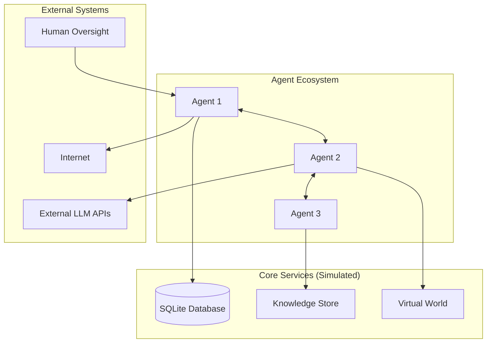

# Design Document

## Part 1: Initial Simulation Environment Design

This section describes the initial design for the self-contained, simulated AI ecosystem.

### 1.1. Overview

The Autonomous AI Ecosystem is a complex multi-agent system that creates a self-evolving community of AI agents. The system combines several advanced concepts: autonomous code modification using Python AST, peer-to-peer communication protocols, social dynamics simulation, continuous learning through web scraping, and collective intelligence through shared knowledge building.

### 1.2. Architecture

The architecture follows a distributed design where each agent operates as an independent process. The system maintains global state through a distributed database and implements safety mechanisms to prevent harmful modifications.

#### High-Level System Architecture (Simulation)



### 1.3. Components and Data Models
This section details the components like `AgentCore`, `AIBrain`, `MemorySystem`, `VirtualWorld`, etc., and the data models for the simulation phase. (Content from original design document is preserved here).

---

## Part 2: AI Workforce Evolution Design

This section outlines the design for transforming the simulation into a production-grade, real-world AI development workforce.

### 2.1. Evolved Architecture Overview

The core design philosophy shifts from a simulated environment to a **Distributed AI Workforce**. Agents no longer interact with a `VirtualWorld` but with a suite of `Real-World Tools` to perform tangible tasks. The `EcosystemOrchestrator` evolves into a sophisticated workload manager, distributing tasks from a `TaskQueue` and allocating resources like GPUs.

#### High-Level System Architecture (AI Workforce)

```mermaid
graph TB
    subgraph "Agent Workforce"
        A1[DataCurator Agent] <--> A2[Architecture Agent]
        A2 <--> A3[Training Agent]
        A3 <--> A4[Evaluation Agent]
    end
    
    subgraph "Production Infrastructure"
        DB[(PostgreSQL Database)]
        TQ[Task Queue (RabbitMQ/Redis)]
        RA[Resource Allocator]
        TS[Training Service]
    end

    subgraph "Real-World Tools"
        GIT[Git Manager]
        WB[Web Browser]
        API[External APIs]
    end
    
    subgraph "Human Interface"
        CEO[CEO Dashboard]
    end

    CEO --> TQ
    A1 --> TQ
    A2 --> TQ
    A3 --> TQ
    A4 --> TQ

    A1 --> WB
    A2 --> GIT
    A3 --> TS
    TS --> RA
    A4 --> DB

    RA -- Manages --> GPU[GPU Pool (A100/H100)]
```

### 2.2. New and Evolved Components

#### 2.2.1. Tools (`autonomous_ai_ecosystem/tools/`)
This new directory replaces the `world` module. It contains modules that provide agents with real-world capabilities.
- **`git_manager.py`**: Provides an interface for agents to interact with Git repositories (clone, commit, push, pull, branch). Uses the `subprocess` module to execute Git commands.
- **`task_queue.py`**: A client for a production-grade message queue (like RabbitMQ or Redis). Agents will pull tasks from the queue, and the human user (or other agents) can add tasks.
- **`resource_allocator.py`**: A system that manages a pool of computational resources, primarily GPUs. Agents request resources for tasks like model training, and the allocator grants access based on availability and priority.

#### 2.2.2. Services (`autonomous_ai_ecosystem/services/`)
This directory will house more complex, specialized services.
- **`training_service.py`**: A critical new service that allows agents to run ML training jobs. It will take a configuration (model code, dataset path, hyperparameters) and execute a training script (PyTorch/TensorFlow) on a machine with a designated GPU, managed by the `ResourceAllocator`.

#### 2.2.3. Core Infrastructure (`autonomous_ai_ecosystem/core/`)
- **`database_manager.py`**: An evolved database interface that abstracts the backend. It will be updated to support PostgreSQL for robust, scalable, and concurrent data storage, replacing SQLite.
- **`communication/` (Refactored)**: The P2P communication system will be refactored to use a central message bus (RabbitMQ/Redis) for scalability and reliability, moving away from a pure mesh network.

### 2.3. Evolved Agent Roles
Agents will be specialized through their genetic code and learning paths to perform specific roles within the AI R&D lifecycle:
- **`DataCuratorAgent`**: Focuses on using the `WebBrowser` tool to find and process datasets.
- **`ArchitectureAgent`**: Focuses on using the `GitManager` to read and write model architecture code.
- **`TrainingAgent`**: Interacts with the `TrainingService` to launch and monitor experiments.
- **`EvaluationAgent`**: Interacts with the `DatabaseManager` to log results and with other tools to run benchmarks.
- **`HypothesisAgent`**: A high-level agent that analyzes results from the database and plans new tasks to be placed on the `TaskQueue`.

### 2.4. Technology Stack Update
- **Primary Language**: Python 3.8+
- **ML Frameworks**: PyTorch, TensorFlow
- **Database**: PostgreSQL
- **Message Queue**: RabbitMQ or Redis
- **Version Control**: Git
- **Containerization**: Docker (for deployment and agent sandboxing)
- **Orchestration**: Kubernetes (for large-scale cloud deployment)
