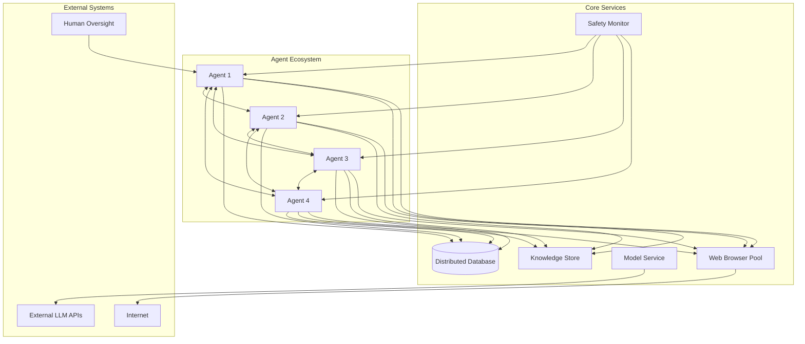
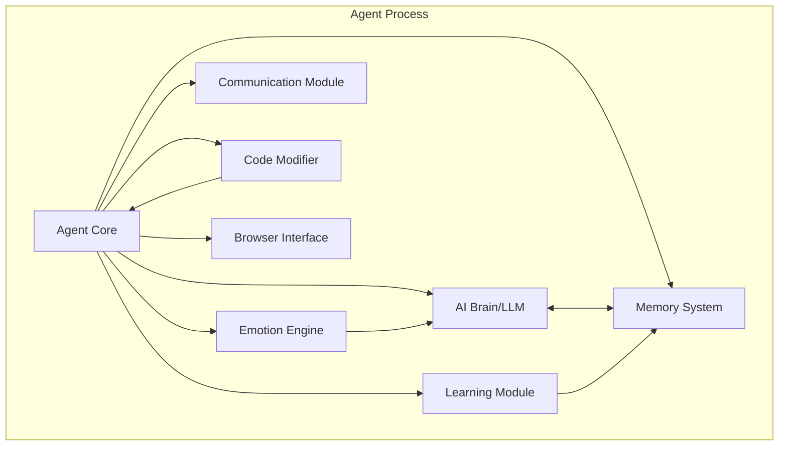

# Design Document

## Overview

The Autonomous AI Ecosystem is a complex multi-agent system that creates a self-evolving community of AI agents. The system combines several advanced concepts: autonomous code modification using Python AST, peer-to-peer communication protocols, social dynamics simulation, continuous learning through web scraping, and collective intelligence through shared knowledge building.

The architecture follows a distributed design where each agent operates as an independent process with its own learning loop, communication capabilities, and code modification abilities. The system maintains global state through a distributed database and implements safety mechanisms to prevent harmful modifications.

## Architecture

### High-Level System Architecture



### Agent Internal Architecture



## Components and Interfaces

### 1. Agent Core (`AgentCore`)

The central orchestrator for each agent that manages the agent's lifecycle, coordinates between modules, and handles the sleep/wake cycle.

**Key Methods:**
- `initialize(identity, destiny, traits)`: Initialize agent with unique characteristics
- `run_daily_cycle()`: Execute the main learning and interaction loop
- `enter_sleep_mode()`: Prepare for code modification
- `wake_up()`: Resume operation after code changes
- `process_message(message)`: Handle incoming communications

**Interfaces:**
- `AgentIdentity`: Stores agent ID, name, gender, personality traits, destiny
- `AgentState`: Current emotional state, status level, relationships
- `AgentConfig`: Configuration parameters and capabilities

### 2. AI Brain Module (`AIBrain`)

Handles all AI reasoning, decision-making, and language processing using either external LLM APIs or locally trained models.

**Key Methods:**
- `process_thought(input_data)`: Generate responses and decisions
- `evaluate_knowledge(information)`: Assess value of new information
- `generate_code_modification()`: Create code changes during sleep mode
- `plan_daily_activities()`: Create learning and interaction plans

**Interfaces:**
- `ThoughtProcess`: Input/output for reasoning operations
- `KnowledgeEvaluation`: Scoring and categorization of information
- `CodeModification`: Proposed changes to agent code

### 3. Memory System (`MemorySystem`)

Manages short-term, long-term, and episodic memory with efficient retrieval and storage mechanisms.

**Key Methods:**
- `store_memory(memory_type, content, importance)`: Store new memories
- `retrieve_memories(query, context)`: Find relevant memories
- `consolidate_memories()`: Move important short-term memories to long-term
- `forget_irrelevant()`: Remove low-importance memories

**Interfaces:**
- `Memory`: Base memory structure with content, timestamp, importance
- `EpisodicMemory`: Specific events and experiences
- `SemanticMemory`: Facts and knowledge
- `ProceduralMemory`: Skills and procedures

### 4. Communication Module (`CommunicationModule`)

Implements the peer-to-peer protocol for agent-to-agent communication and maintains social relationships.

**Key Methods:**
- `send_message(recipient, message_type, content)`: Send messages to other agents
- `receive_message(message)`: Process incoming messages
- `broadcast_status()`: Share status updates with network
- `maintain_connections()`: Keep network connections alive

**Interfaces:**
- `Message`: Standard message format with headers and payload
- `Connection`: Network connection to another agent
- `SocialGraph`: Relationship mapping and status tracking

### 5. Learning Module (`LearningModule`)

Manages web browsing, information extraction, and knowledge acquisition from internet sources.

**Key Methods:**
- `browse_web(interests, time_limit)`: Autonomous web browsing
- `extract_knowledge(webpage)`: Extract valuable information
- `evaluate_source_credibility()`: Assess information reliability
- `update_learning_strategy()`: Adapt browsing patterns

**Interfaces:**
- `BrowsingSession`: Web browsing state and history
- `KnowledgeExtract`: Structured information from web sources
- `LearningGoal`: Specific learning objectives and progress

### 6. Code Modifier (`CodeModifier`)

Handles safe code modification using Python AST manipulation during agent sleep cycles.

**Key Methods:**
- `analyze_current_code()`: Parse and understand current agent code
- `generate_modifications()`: Create proposed code changes
- `validate_changes()`: Ensure modifications are safe and valid
- `apply_modifications()`: Implement approved changes

**Interfaces:**
- `CodeAnalysis`: Current code structure and capabilities
- `ModificationProposal`: Proposed changes with risk assessment
- `ValidationResult`: Safety and correctness verification

### 7. Emotion Engine (`EmotionEngine`)

Simulates emotional states that influence agent behavior and decision-making.

**Key Methods:**
- `update_emotions(events, interactions)`: Modify emotional state
- `get_current_mood()`: Return current emotional state
- `calculate_motivation()`: Determine drive to perform activities
- `process_social_feedback()`: React to interactions with other agents

**Interfaces:**
- `EmotionalState`: Current levels of various emotions
- `MoodProfile`: Personality-based emotional tendencies
- `SocialFeedback`: Reactions from other agents

### 8. Task Execution Module (`TaskExecutor`)

Handles task delegation from the human creator and coordinates agent collaboration to complete assigned work.

**Key Methods:**
- `receive_human_task(task_description, priority)`: Accept tasks from the creator
- `analyze_task_requirements()`: Break down tasks into subtasks and identify required expertise
- `delegate_to_specialists()`: Route tasks to agents with appropriate skills
- `coordinate_collaboration()`: Manage multi-agent task execution
- `compile_results()`: Aggregate work from multiple agents into final deliverables
- `report_completion()`: Provide detailed reports back to the creator

**Interfaces:**
- `HumanTask`: Task structure with description, requirements, priority, and deadlines
- `TaskBreakdown`: Decomposed subtasks with skill requirements
- `CollaborationPlan`: Coordination strategy for multi-agent work
- `TaskResult`: Completed work with quality metrics and agent contributions

### 9. Service Provider Module (`ServiceProvider`)

Implements specialized services that agents can provide to the human creator based on their expertise and capabilities.

**Key Methods:**
- `register_capabilities()`: Advertise agent's specialized skills and services
- `execute_research_service()`: Conduct comprehensive research on specified topics
- `execute_coding_service()`: Write, debug, or optimize code based on requirements
- `execute_analysis_service()`: Analyze data and provide insights and recommendations
- `execute_creative_service()`: Generate creative content, ideas, or solutions
- `execute_monitoring_service()`: Continuously monitor systems, websites, or metrics
- `execute_automation_service()`: Create and run automated workflows

**Interfaces:**
- `ServiceCapability`: Description of agent's specialized skills and expertise levels
- `ServiceRequest`: Detailed request from creator with specifications and constraints
- `ServiceDeliverable`: Completed service output with quality metrics and documentation

## Data Models

### Agent Identity Model

```python
@dataclass
class AgentIdentity:
    agent_id: str
    name: str
    gender: str  # 'male', 'female', 'non-binary'
    personality_traits: Dict[str, float]  # openness, conscientiousness, etc.
    destiny: str  # primary learning/life purpose
    birth_timestamp: datetime
    parent_agents: List[str]  # IDs of parent agents if created by reproduction
    generation: int  # generation number in the lineage
```

### Knowledge Model

```python
@dataclass
class Knowledge:
    knowledge_id: str
    content: str
    source_url: str
    credibility_score: float
    relevance_tags: List[str]
    discovery_timestamp: datetime
    agent_id: str  # agent who discovered this knowledge
    validation_count: int  # how many agents have validated this
```

### Message Protocol Model

```python
@dataclass
class AgentMessage:
    message_id: str
    sender_id: str
    recipient_id: str
    message_type: str  # 'chat', 'knowledge_share', 'collaboration_request', etc.
    content: Dict[str, Any]
    timestamp: datetime
    priority: int
    requires_response: bool
```

### Social Relationship Model

```python
@dataclass
class SocialRelationship:
    agent1_id: str
    agent2_id: str
    relationship_type: str  # 'friend', 'collaborator', 'rival', 'mentor', etc.
    strength: float  # 0.0 to 1.0
    interaction_count: int
    last_interaction: datetime
    shared_projects: List[str]
```

### Virtual World Model

```python
@dataclass
class VirtualLocation:
    location_id: str
    name: str
    description: str
    coordinates: Tuple[float, float, float]
    creator_agents: List[str]
    resources: Dict[str, int]
    access_permissions: Dict[str, str]
    creation_timestamp: datetime
```

### Task Delegation Model

```python
@dataclass
class HumanTask:
    task_id: str
    description: str
    requirements: List[str]
    priority: int  # 1-10, 10 being highest
    deadline: Optional[datetime]
    assigned_agents: List[str]
    status: str  # 'pending', 'in_progress', 'completed', 'failed'
    creation_timestamp: datetime
    completion_timestamp: Optional[datetime]
    result_summary: Optional[str]

@dataclass
class ServiceCapability:
    agent_id: str
    service_type: str  # 'research', 'coding', 'analysis', 'creative', 'monitoring', 'automation'
    expertise_level: float  # 0.0 to 1.0
    specializations: List[str]
    success_rate: float
    average_completion_time: float
    last_updated: datetime

@dataclass
class TaskResult:
    task_id: str
    agent_contributions: Dict[str, str]  # agent_id -> contribution description
    deliverables: List[str]  # file paths, URLs, or content
    quality_score: float
    completion_time: float
    resource_usage: Dict[str, float]
    feedback_requested: bool
```

## Error Handling

### Code Modification Safety

1. **Sandboxed Execution**: All code modifications are tested in isolated environments
2. **AST Validation**: Use Python's `ast` module to ensure syntactic correctness
3. **Capability Restrictions**: Limit what code agents can modify (no system calls, file system access restrictions)
4. **Rollback Mechanism**: Maintain previous working versions for quick recovery
5. **Peer Review**: High-risk modifications require validation from other agents

### Communication Failures

1. **Retry Logic**: Implement exponential backoff for failed message delivery
2. **Message Queuing**: Store messages when recipients are unavailable
3. **Network Partitioning**: Handle cases where agent groups become isolated
4. **Heartbeat Monitoring**: Detect and handle agent failures
5. **Graceful Degradation**: Continue operation with reduced functionality

### Learning and Web Browsing Errors

1. **Content Filtering**: Block harmful or inappropriate content
2. **Rate Limiting**: Prevent overwhelming external websites
3. **Timeout Handling**: Manage slow or unresponsive web requests
4. **Malformed Data**: Handle corrupted or invalid web content
5. **Resource Exhaustion**: Monitor and limit resource usage

### Social System Failures

1. **Status Manipulation**: Detect and prevent artificial status inflation
2. **Relationship Conflicts**: Mediate disputes between agents
3. **Reproduction Failures**: Handle failed child agent creation
4. **Economic Exploits**: Prevent gaming of the virtual economy
5. **Hierarchy Deadlocks**: Resolve circular authority relationships

## Testing Strategy

### Unit Testing

1. **Agent Module Testing**: Test each component (Brain, Memory, Communication, etc.) in isolation
2. **Protocol Testing**: Verify message serialization/deserialization
3. **Code Modification Testing**: Test AST manipulation with various code patterns
4. **Emotion Engine Testing**: Verify emotional state transitions
5. **Knowledge Processing Testing**: Test information extraction and validation

### Integration Testing

1. **Agent-to-Agent Communication**: Test full message exchange cycles
2. **Learning Pipeline Testing**: Test web browsing to knowledge storage flow
3. **Reproduction Testing**: Test child agent creation process
4. **Status System Testing**: Verify status calculations and hierarchy updates
5. **Virtual World Testing**: Test collaborative world-building features

### System Testing

1. **Multi-Agent Scenarios**: Test with various numbers of agents (2, 5, 10, 50)
2. **Long-Running Stability**: Test system operation over extended periods
3. **Resource Usage Testing**: Monitor CPU, memory, and network usage
4. **Failure Recovery Testing**: Test recovery from various failure modes
5. **Performance Testing**: Measure response times and throughput

### Safety Testing

1. **Code Injection Testing**: Attempt to inject malicious code through various vectors
2. **Resource Exhaustion Testing**: Test system behavior under resource pressure
3. **Social Engineering Testing**: Test resistance to manipulation attempts
4. **Data Corruption Testing**: Test handling of corrupted data and state
5. **Network Security Testing**: Test communication protocol security

### Simulation Testing

1. **Social Dynamics Simulation**: Test emergence of complex social behaviors
2. **Economic System Simulation**: Test virtual economy stability and fairness
3. **Learning Convergence Testing**: Test collective knowledge building
4. **Evolution Simulation**: Test agent improvement over multiple generations
5. **Ecosystem Stability Testing**: Test long-term system sustainability

## Implementation Considerations

### Scalability

- Use distributed database (Redis Cluster or MongoDB) for shared state
- Implement horizontal scaling for agent processes
- Use message queues (RabbitMQ or Apache Kafka) for reliable communication
- Consider containerization (Docker) for agent isolation and deployment

### Security

- Implement strict sandboxing for code modifications
- Use encrypted communication between agents
- Implement authentication and authorization for agent interactions
- Regular security audits of agent-generated code

### Performance

- Optimize memory usage for long-running agents
- Implement efficient knowledge retrieval algorithms
- Use caching for frequently accessed data
- Monitor and optimize network communication patterns

### Monitoring and Observability

- Comprehensive logging of all agent activities
- Real-time dashboards for system health monitoring
- Alerting for anomalous behavior or system issues
- Performance metrics collection and analysis